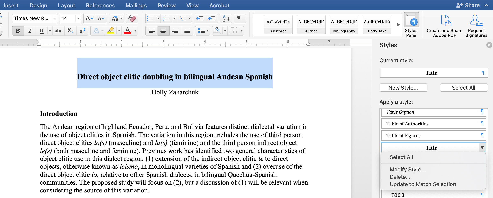
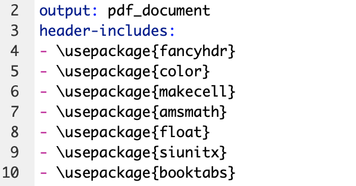
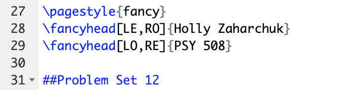
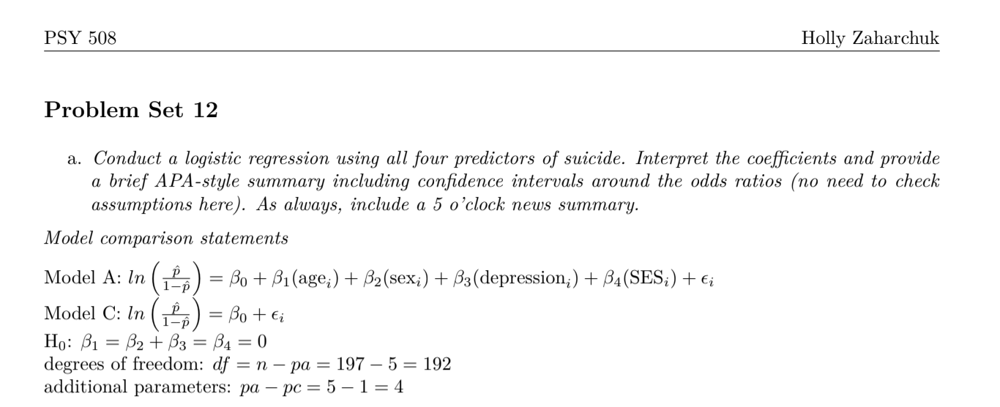
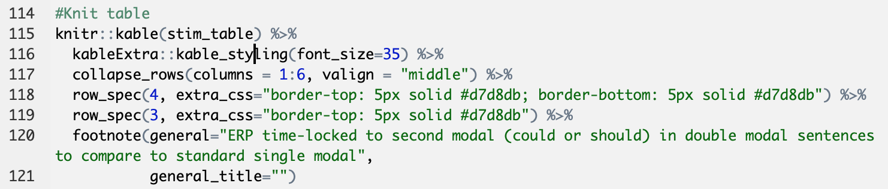
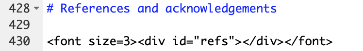
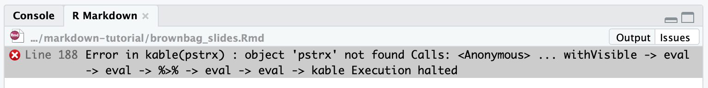
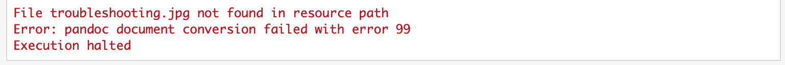

```{r setup, echo = FALSE}
## R setup ##

chooseCRANmirror(graphics = FALSE, ind = 1)
knitr::opts_chunk$set(warning = FALSE, message = FALSE, echo = TRUE, eval = TRUE)

## Load packages ##

# Package list
pkg_list <- c("plyr","tidyverse", "data.table", "ggplot2", "kableExtra")

# Load packages
pacman::p_load(pkg_list, character.only = TRUE)
```

# What is R Markdown?

<!-- Custom CSS formatting to left-align text and remove image borders -->
<style type="text/css">
  .reveal p {
    text-align: left;
  }
  .reveal ul {
    display: block;
  }
  .reveal ol {
    display: block;
  }
  .reveal section img { 
    background:none; 
    border:none; 
    box-shadow:none; 
  }
</style>

- Markup language
- R Markdown != R

# Parts of a Markdown document

1. YAML header
2. Markdown language
3. Code chunks

## YAML header

Global options for outputs/formatting


## Markdown

Plain text formatting allows for conversion to multiple document types


## Chunks

```{r example_chunk}
# This is a chunk of R code that adds an image
knitr::include_graphics("images/example_chunk.png")
```

# Creating output

- Options for creating output
  - Specify output type with YAML header and "knit"
  - Render with R command
- [Rmd > knitr > md > pandoc > output](https://ulyngs.github.io/rmarkdown-workshop-2019/slides/Day2.html#35)
- [Deep dive on relations among different aspects of R Markdown documents](https://stackoverflow.com/questions/40563479/relationship-between-r-markdown-knitr-pandoc-and-bookdown)

<!-- Start with plain text file > execute code and knit into file > process markup syntax > convert plain text using YAML/Render options > create outputs -->

## Output types

- PDF: requires $\LaTeX$ to compile (see [TinyTeX](https://yihui.org/tinytex/) distribution)
- HTML
- Microsoft Office (Word/Powerpoint)

## YAML specification

- Use *output* argument in YAML header
- Pay attention to indentation and colons
- Press `knit` button or command/CTRL-shift-K

## Render

- Render file in console: `rmarkdown::render(file, output_format)`
- Option to create PDF from HTML: `pagedown::chrome_print(file)`

# Using templates

1. Built-in templates
2. Templates from R packages
3. User-defined templates

## Built-in templates

- [Presentations](https://rmarkdown.rstudio.com/lesson-11.html)
  - ioslides and Slidy for HTML
  - Beamer for PDF
- Shiny documents and presentations (interactive)

## R packages

<!-- Packages from GitHub vs. CRAN -->
- [Presentations: `revealjs`](https://cran.r-project.org/web/packages/revealjs/index.html)
- [CV: `vitae`](https://github.com/mitchelloharawild/vitae)
- [Poster: `posterdown`](https://github.com/brentthorne/posterdown)
- [APA articles: `papaja`](https://github.com/crsh/papaja)
- [Journal templates: `rticles`](https://bookdown.org/yihui/rmarkdown/rticles-templates.html)

## User-defined templates

$\LaTeX$ templates


## User-defined templates

Word Document


# Formatting

1. YAML parameters and references
2. $\LaTeX$ and CSS code in Markdown
3. Template documents

## YAML parameters

- [General YAML parameters](https://ymlthis.r-lib.org/articles/yaml-fieldguide.html)
- Template-specific parameters (look at package documentation)

## YAML references

These files go in the same place as your .Rmd

- Bibliography: [.bib](https://rmarkdown.rstudio.com/authoring_bibliographies_and_citations.html) (I use BibDesk for my reference manager)
- Bibiography style: .csl (see my [CV](https://github.com/hollzzar/zaharchuk-cv) and [Psychonomics poster](https://github.com/hollzzar/psychonomics-poster) repos for APA 6 files)
- $\LaTeX$ styling: .cls
- HTML styling: .css
- Interacting with pandoc: .lua ([multiple bibliographies](https://github.com/pandoc/lua-filters/tree/master/multiple-bibliographies))

## $\LaTeX$ and CSS

- $\LaTeX$ with PDFs
  - Packages
  - Symbols: [here](https://www.rpi.edu/dept/arc/training/latex/LaTeX_symbols.pdf) and [here](https://www.tug.org/tugboat/tb17-2/tb51rei.pdf)
  - Type-setting
- [CSS](https://developer.mozilla.org/en-US/docs/Web/CSS) with HTML

## $\LaTeX$

Examples from my stats homework




## $\LaTeX$



## CSS/HTML

Examples from my [Psychonomics poster](https://github.com/hollzzar/psychonomics-poster/blob/master/Psychonomics.Rmd)




## Updating template documents

```{r template}
# Make dataframe with installed packages
pkgs <- installed.packages() %>%
  as.data.frame()

# Pull posterdown package 
pstr <- pkgs %>% 
  select(Package, LibPath, Version, Depends, Imports) %>%
  dplyr::filter(Package == "posterdown")

# Make table
kable(pstr) %>%
  kable_styling(bootstrap_options = "condensed", 
                font_size = 18)
```

## Updating template documents

- Save the original and move to a different location
- Make one change at a time
- Name the updated template with the same name in the same place as the original

# Trouble-shooting

<center></center>

## Identifying issues


- Warnings vs. errors
- Console vs. chunk
- Markdown environment vs. R environment
- When to use package specification `::`

## Errors

- Chunk error: 
- Markdown/YAML error: 

## Tips

- Run all chunks individually before compiling
- Clear all variables: `rm(ls = list())`
- Restart R environment: control/CTRL + fn + shift + F10

# Helpful reference documents

- [R Markdown Guide](https://bookdown.org/yihui/rmarkdown/)
- [R Markdown Cheat Sheet](https://rstudio.com/wp-content/uploads/2016/03/rmarkdown-cheatsheet-2.0.pdf)
- [R Markdown Reference Guide](https://rstudio.com/wp-content/uploads/2015/03/rmarkdown-reference.pdf)
- [Keyboard shortcuts](https://support.rstudio.com/hc/en-us/articles/200711853-Keyboard-Shortcuts)
- [`knitr` documentation](https://yihui.org/knitr/)

# Random tidbits

- Escape characters with a backslash \\
- Call R objects in Markdown by \~sandwiching\~ with backticks \`
- Automatic bracket/quote/asterisk wrapping
- Dollar signs for $\LaTeX$ math mode (but also be careful with pandoc)
- [Sublime Text](https://www.sublimetext.com/3) text editor
- [`scholar` package for automatically downloading citations from Google Scholar](https://github.com/jkeirstead/scholar)
- [Updating your TeX distribution](https://tex.stackexchange.com/questions/55437/how-do-i-update-my-tex-distribution)
- Plug-ins

# R Stuff

- Regular expressions for working with free response text (cheat sheet [here](https://rstudio.com/wp-content/uploads/2016/09/RegExCheatsheet.pdf))
- `assign()` function for dynamic variable names
- Store `ggplot` parameters in a `list()`
- `source()`
- `%notin%`

# Keys to success

- Data are read only
- Comment your code excessively
- Keep chunks small