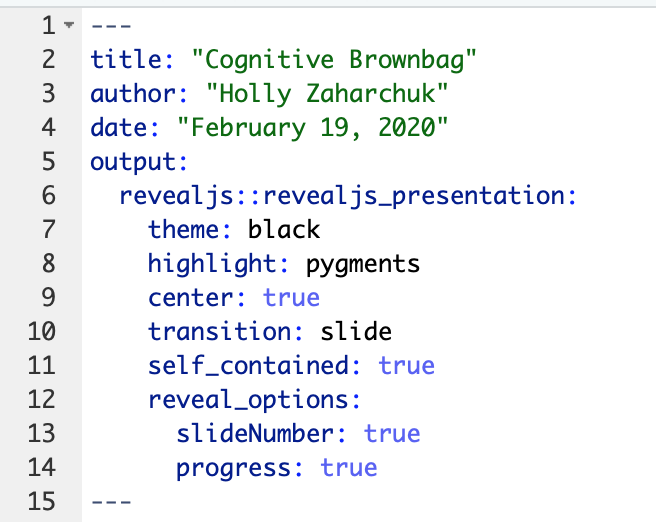
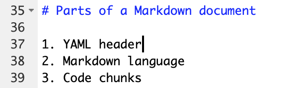
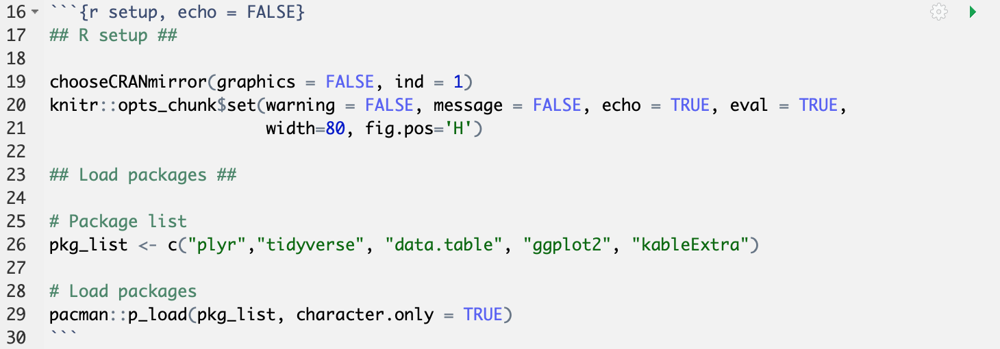

```{r setup, echo = FALSE}
## R setup ##

chooseCRANmirror(graphics = FALSE, ind = 1)
knitr::opts_chunk$set(warning = FALSE, message = FALSE, echo = TRUE, eval = TRUE,
                      width=100, fig.pos='H')

## Load packages ##

# Package list
pkg_list <- c("plyr","tidyverse", "data.table", "ggplot2", "kableExtra")

# Load packages
pacman::p_load(pkg_list, character.only = TRUE)
```

# What is R Markdown?

<!-- Custom CSS formatting to left-align text and remove image borders -->
<style type="text/css">
  .reveal p {
    text-align: left;
  }
  .reveal ul {
    display: block;
  }
  .reveal ol {
    display: block;
  }
  .reveal section img { 
    background:none; 
    border:none; 
    box-shadow:none; 
  }
</style>

- Markup language
- R Markdown != R

# Parts of a Markdown document

1. YAML header
2. Markdown language
3. Code chunks

## YAML header



## Markdown



## Chunks

```{r example_chunk}
# This is a chunk of R code that adds an image

```

# Creating output

- Options
  - Specify output type with YAML header and "knit"
  - Render with R command
- Rmd > knitr > md > pandoc > output

## Output types

- PDF
- HTML
- Microsoft Office (Word/Powerpoint)

## YAML specification

## Using templates

## Render

## Options

# Formatting

- YAML parameters
- $\LaTeX$ and CSS code in Markdown
- Template documents

## YAML parameters

- General YAML parameters
- Template-specific parameters

## $\LaTeX$&nbsp;and CSS

- $\LaTeX$ with PDFs
- CSS with HTML

## Templates

```{r template}
# Make dataframe with installed packages
pkgs <- installed.packages() %>%
  as.data.frame()

# Pull posterdown package 
pstr <- pkgs %>% 
  select(Package, LibPath, Version, Depends, Imports) %>%
  dplyr::filter(Package == "posterdown")

# Make table
kable(pstr) %>%
  kable_styling(bootstrap_options = "condensed", 
                font_size = 20)
```