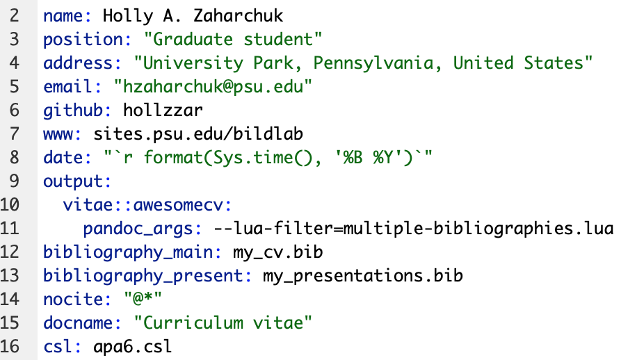
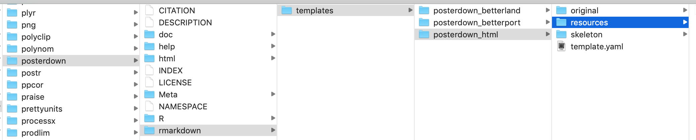
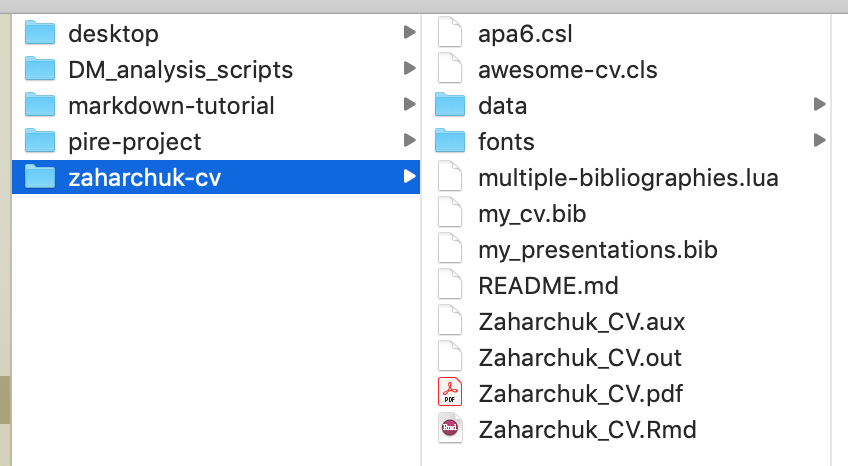

```{r setup, echo = FALSE}
## R setup ##

chooseCRANmirror(graphics = FALSE, ind = 1)
knitr::opts_chunk$set(warning = FALSE, message = FALSE, echo = TRUE, eval = TRUE)

## Load packages ##

# Package list
pkg_list <- c("plyr","tidyverse", "data.table", "ggplot2", "kableExtra")

# Load packages
pacman::p_load(pkg_list, character.only = TRUE)
```

# What is R Markdown?

<!-- Custom CSS formatting to left-align text and remove image borders -->
<style type="text/css">
  .reveal p {
    text-align: left;
  }
  .reveal ul {
    display: block;
  }
  .reveal ol {
    display: block;
  }
  .reveal section img { 
    background:none; 
    border:none; 
    box-shadow:none; 
  }
</style>

- [Markdown](https://en.wikipedia.org/wiki/Markdown) is a specific [markup language](https://en.wikipedia.org/wiki/Markup_language) with plain-text-formatting syntax
- [R Markdown](https://cran.r-project.org/web/packages/stationery/vignettes/Rmarkdown.pdf) is a kind of markdown document
- R Markdown combines R code and markdown in the RStudio integrated development environment (IDE)
- R Markdown != R

## What are we doing today?

1. R Markdown overview
2. Practice activity
3. Optional beginner R
4. Optional intermediate R

<center></center>

## What won't we talk about today?

- Making a website with R Markdown and GitHub (I want to do this in the future!)
- Using R Projects
- Using GitHub for version control and open science (talk to me about this offline)

# Parts of an R Markdown document

1. YAML header
2. Markdown
3. Code chunks

## YAML header

Global options for outputs/formatting


## Markdown

Plain-text-formatting syntax allows for conversion to multiple document types


## Code chunks

```{r example_chunk}
# This is a chunk of R code that adds an image
knitr::include_graphics("images/example_chunk.png")
```

# Creating output

- Options for creating output
  - Specify output type with YAML header and "knit"
  - Render with R command
- Processing flow: [Rmd > knitr > md > pandoc > output](https://ulyngs.github.io/rmarkdown-workshop-2019/slides/Day2.html#35)
- [Deep dive on relations among different aspects of R Markdown documents](https://stackoverflow.com/questions/40563479/relationship-between-r-markdown-knitr-pandoc-and-bookdown)

<!-- Start with Rmd file > execute code and knit into file > process markdown syntax > convert plain text using YAML/Render options > create outputs -->

## Output types

- PDF: requires $\LaTeX$ to compile ([TinyTeX](https://yihui.org/tinytex/) distribution)
- HTML
- Microsoft Office (Word/Powerpoint)

## YAML specification

- Use **output** argument in YAML header
- Pay attention to indentation and colons
- Press `knit` button or command/CTRL + shift + K

## Render

Render files in the console with `rmarkdown::render(file, output_format)` (this is what `knit` is doing)

Option to create PDF from HTML with `pagedown::chrome_print(file)`

# Using output templates

1. Built-in templates
2. Templates from R packages
3. User-defined templates

## Built-in templates

- [Presentations](https://rmarkdown.rstudio.com/lesson-11.html)
  - ioslides and Slidy for HTML
  - Beamer for PDF
- [Shiny](https://bookdown.org/yihui/rmarkdown/shiny-documents.html) documents and presentations (interactive)

## R packages

<!-- Packages from GitHub vs. CRAN -->
- Presentations: [`revealjs`](https://cran.r-project.org/web/packages/revealjs/index.html)
- CVs: [`vitae`](https://github.com/mitchelloharawild/vitae)
- Academic posters: [`posterdown`](https://github.com/brentthorne/posterdown)
- APA articles: [`papaja`](https://github.com/crsh/papaja)
- Journal templates: [`rticles`](https://bookdown.org/yihui/rmarkdown/rticles-templates.html)

## User-defined templates

$\LaTeX$ templates (pay attention to \$ in templates)


## User-defined templates

Word Document: use the Styles Pane and "Update to Match Selection" 


# Formatting

1. YAML parameters and references
2. Inline $\LaTeX$ and CSS code
3. Custom edits to templates

## YAML parameters

- [General YAML parameters](https://ymlthis.r-lib.org/articles/yaml-fieldguide.html)
- Template-specific parameters (look at package documentation)

## YAML references

These files go in the same place as your .Rmd

- Bibliography: [.bib](https://rmarkdown.rstudio.com/authoring_bibliographies_and_citations.html) (I use BibDesk for my reference manager)
- Citation style language files: [.csl](https://github.com/citation-style-language/styles) (see my [CV](https://github.com/hollzzar/zaharchuk-cv) and [Psychonomics poster](https://github.com/hollzzar/psychonomics-poster) repos for customized APA 6 files)
- $\LaTeX$ styling: .cls
- HTML styling: .css
- Interacting with pandoc: .lua ([multiple bibliographies](https://github.com/pandoc/lua-filters/tree/master/multiple-bibliographies))

## YAML references

Example from [my CV](https://github.com/hollzzar/zaharchuk-cv) with both template-specific YAML parameters and YAML references



## Inline $\LaTeX$&nbsp; and CSS code

- $\LaTeX$ with PDFs
  - Calling $\LaTeX$ packages
  - Using symbols: useful lists [here](https://www.rpi.edu/dept/arc/training/latex/LaTeX_symbols.pdf) and [here](https://www.tug.org/tugboat/tb17-2/tb51rei.pdf)
  - Using type-setting commands (e.g., \\vspace{12pt})
- [CSS](https://developer.mozilla.org/en-US/docs/Web/CSS) with HTML

## $\LaTeX$

Examples of calling packages in the YAML header and using inline functions from my stats homework (also see [Writing Your Thesis with R Markdown](https://rosannavanhespenresearch.wordpress.com/2016/03/30/writing-your-thesis-with-r-markdown-5-the-thesis-layout/))


## $\LaTeX$

Stats homework output


## CSS/HTML

Examples from [my Psychonomics poster](https://github.com/hollzzar/psychonomics-poster/blob/master/Psychonomics.Rmd)


## Editing templates

To make extremely custom edits to templates, sometimes you have to edit the template documents

1. Find out where your computer stores your R packages and edit the template there
2. If the template generates a style document (e.g., .cls) in the directory with your .Rmd file, you can usually edit that without going to the package

## Package documents

```{r template}
# Make dataframe with installed packages
pkgs <- installed.packages() %>%
  as.data.frame()

# Pull posterdown package 
pstr <- pkgs %>% 
  select(Package, LibPath, Version, Depends, Imports) %>%
  dplyr::filter(Package == "posterdown")

# Make table
kable(pstr) %>%
  kable_styling(bootstrap_options = "condensed", 
                font_size = 18)
```

## Package documents

- Save the original template and move it to a different location
- Make one change at a time
- Name the updated template with the same name in the same place as the original



## Directory documents

Knitting the `vitae::awesomecv` template created a .cls file that I could edit to change font sizes/colors



# Trouble-shooting

<center></center>

## Identifying issues


- Warnings vs. errors
- Console vs. chunk
- Markdown environment vs. R environment
- Package specification `::` for unloaded packages and conflicting functions

## Warnings

Warnings won't stop your document from compiling, but generally indicate that you should change something in your code


## Errors

Chunk error 

Markdown/YAML error 

## R code and environments

Running a chunk executes the code in the console and adds the output to your R environment; however, your R environment is separate from the environment created when "knitting" a document


## R code and environments

```{r environment, eval = FALSE}
# Define new variable y
y <- 100

# When I run this chunk, I get the expected output (150),
# but it fails when I try to knit the document
print(x + y)
```

<center></center>

## Tips

- Clear all variables: `rm(ls = list())`
- Restart R environment: control/CTRL + fn + shift + F10
- Run all chunks individually **in order** before compiling to test code
- Search for information
  - Use Help window
  - Search for package in console with `?package`
  - Google package and error

Stack Overflow is your friend!

# Takeaways

1. YAML header: define output types, templates, and additional parameters (e.g., bibliography)
2. Setup chunk: define global chunk options
3. Markdown: add information/description and control local text behavior with $\LaTeX$/CSS (depending on output)
4. Chunks: add R code and control local chunk behavior

## Keys to success

- Treat your data as read-only
- Comment code early and often
- Keep code chunks small
- Label chunks for diagnosing issues
- Nest all files under one directory (if possible)

## General information

- Escape characters with a backslash \\ (this also applies to any chunk output containing strings)
- Call R objects and functions in markdown/YAML by \~sandwiching\~ with backticks \`\`
- Automatic bracket/quote/asterisk wrapping
- Dollar signs for $\LaTeX$ math mode (but also be careful with pandoc)
- Line spacing matters in markdown

## Reference documents

- [R Markdown Guide](https://bookdown.org/yihui/rmarkdown/)
- [R Markdown Cheat Sheet](https://rstudio.com/wp-content/uploads/2016/03/rmarkdown-cheatsheet-2.0.pdf)
- [R Markdown Reference Guide](https://rstudio.com/wp-content/uploads/2015/03/rmarkdown-reference.pdf)
- [Keyboard shortcuts](https://support.rstudio.com/hc/en-us/articles/200711853-Keyboard-Shortcuts)
- [`knitr` documentation](https://yihui.org/knitr/)

## Other packages/tools

- [Sublime Text](https://www.sublimetext.com/3) text editor
- [`scholar` package](https://github.com/jkeirstead/scholar) for automatically downloading citations from Google Scholar
- `devtools` package for installing packages/plug-ins from GitHub (e.g., `papaja`)
- [wordcountaddin plug-in](https://github.com/benmarwick/wordcountaddin) for checking word count and readability

## Updating software/packages

- [Update your TeX distribution](https://tex.stackexchange.com/questions/55437/how-do-i-update-my-tex-distribution) from the command line
- Update all packages (including `rmarkdown`) in library with `update.packages(path)` 
- Update individual packages by reinstalling with `install.packages(package)`
- Update R in the console with `updateR` package
- Redownload RStudio to update

## Pause

<center>Questions?</center>

<center></center>

# Beginner R

- Basic R functionality
- Reading in data
- Tidy R philosophy
- Manipulating data with [core `tidyr` functions](https://rstudio.com/wp-content/uploads/2015/02/data-wrangling-cheatsheet.pdf)

## Basic R functionality

- Variables
- Functions
- Operators

## Variables

The way R stores your information will determine the kinds of functions/operators you can use

- Data: dataframes
- Values: lists, vectors, matrices, etc.

```{r variables}
# Variables can be numbers, strings, etc.
some_val <- 200
other_val <- TRUE

# Variables can also be lists of numbers, strings, etc.
a_list <- c("a", "b", "c")

# We can also make dataframes (which are essentially special lists)
a_dataframe <- tibble(column_1 = 1:3,
                      column_2 = a_list)
```

## Functions

Functions take a certain number and certain types of "arguments"

- `base` R functions: part of downloading R
- Packages: need to be installed, then loaded
  - `install.packages(package)` once (or to update package)
  - `library(package)` every R session

## Functions

Use Help window or `?package` to check argument names, types, and defaults

- Named arguments without values are required (and user-defined)
- Named arguments with values show defaults
- Elipses mean that you can add other optional arguments

```{r arguments, eval = FALSE}
# file: required
# header = TRUE: default
# ...: other potential arguments, like stringsAsFactors = FALSE
read.csv(file, header = TRUE, sep = ",", quote = "\"",
         dec = ".", fill = TRUE, comment.char = "", ...)
```

## `base` R

```{r base_functions_1}
# base R function
# Count the number of rows in this dataframe
nrow(a_dataframe)
```

```{r base_functions_2, eval = FALSE}
# If I give nrow() too many arguments, it will throw an error
nrow(a_dataframe, a_list)
```

```{r base_functions_3}
# If I give it the wrong kind of argument, it will just return NULL
# Some functions won't run at all with wrong kind of argument
nrow(a_list)
```

## Packages

```{r pkg_functions}
# scholar package 
library(scholar)

# get_publications function
# Pull publications from Google Scholar for Marie Curie
get_publications("EmD_lTEAAAAJ&EmD_lTEAAAAJ&") %>% 
  dplyr::filter(cites > 30) %>% 
  distinct(title, .keep_all = TRUE) %>%
  select(author, title) %>%
  head(2) %>%
  kable()
```

## Operators

- Relational: >, <, ==, !=, <=, >=
  - `is.na()`, `exists()`, etc. will return TRUE/FALSE values
  - `grep()`, `filter()`, `str_detect()`, etc. use TRUE/FALSE values
- Logical: !, &, &&, |, ||
- Arithmetic

## Reading in data


General parameters for csv files

```{r csv, eval = FALSE}
read.csv("file_name.csv", 
         header = TRUE, 
         stringsAsFactors = FALSE, 
         check.names = FALSE, 
         na.strings = "")
```

Avoid special characters (including spaces) in file names, directories, and column headers!

## Reading in data

- `readxl` package for Excel spreadsheets
- APIs for direct access to online data
  - `qualtRics` package for Qualtrics data
  - `ggmap` package for Google services (geolocation data)
- `read_table()` from `readr` package for text files

## Tidy R philosophy

- One variable per column
- One observation per row

## Manipulating data with `tidyr`

> - `%>%`: pass the results of one function on to another
> - `select()`: choose columns by name
> - `mutate()`: add/change columns
> - `filter()`: filter for (or out) rows
> - `group_by()` and `summarise()`: perform operations on groups of data
> - ~~`gather()` and `spread()`~~ `pivot_longer()` and `pivot_wider()`: condense multiple columns into one or the inverse
> - `separate()` and `unite()`: split a column into multiple or the inverse

## Other helpful `tidyr` functions

> - `slice()`: choose a row
> - `pull()`: choose a column
> - Helper functions for `select()` (e.g., `contains()`)
> - `join` family of functions: combine datasets based on a shared unique identifier
> - `union()`: combine datasets by rows (column names must be the same)
> - `replace_na()`/`drop_na()`: alter/remove rows with NA values 

## Helpful `base` R functions

> - `rbind()` and `cbind()`: add rows/columns
> - `nrow()` and `ncol()`: count rows/columns
> - `unique()`: pull unique values
> - Indexing with `var$column` and `var[row, column]`
> - `which()` with column/row indexing

## Other packages and functions

> - `tibble` package for dataframes with `tibble()`
> - `kableExtra()` for `kable()` tables
> - `ggplot2` package for graphs (cheat sheet [here](https://github.com/rstudio/cheatsheets/blob/master/data-visualization-2.1.pdf))
> - `factor()` for ordering text labels in graphs
> - Use `na.rm = TRUE` argument (e.g., in `mean()`) to remove NA values from calculations

# Intermediate R

- Dealing with free-response text
- Dynamic variable creation and reference
- Helpful functions
- Other tips

## Free-response text

- Regular expressions (cheat sheet [here](https://rstudio.com/wp-content/uploads/2016/09/RegExCheatsheet.pdf))
- Pattern matching
  - Return position/value of elements that match a pattern: `grep()`, `agrep()`
  - Return TRUE/FALSE: `grepl()`, `agrepl()`, `str_detect()`
  - Change a pattern: `sub()`, `gsub()`, `replace()`
  - Return position of pattern for all elements: `regexpr()`, `gregexpr()`, `regexec()`
- Use `perl = TRUE` argument to handle especially complex patterns
  
## Free-response text

```{r text_1}
# List of elements
fruit <- c("apple", "banana", "pear", "pinapple")

# grep position
grep(pattern = "le", x = fruit)

# grep value
grep(pattern = "le", x = fruit, value = TRUE)
```

## Free-response text

```{r text_2}
# agrep (can also specify value = TRUE)
agrep(pattern = "le", x = fruit, max.distance = 0.1)

# regexpr
# match.length attribute gives starting position of match
# index.type attribute gives length of matched text
regexpr(pattern = "le", text = fruit)
```

## Dynamic variables

```{r assign_1}
# Variables
vals <- rep(1:3, 3)
name <- "assign_example"

# Assign values to variable name
assign(name, vals)

# Use the variable as usual
assign_example
```

## Dynamic variables

```{r assign_2}
# You can also get the new variable from the name
get(name)

# You can add to this variable dynamically as well
assign(name, c(get(name), 4:6))

# New output
assign_example
```

## Helpful functions

- `apply()`, `lapply()`, `sapply()`, `tapply()`
- `source()` variables from R scripts
- `%notin%` and `%in%` (compared to != and ==)

```{r notin, eval = FALSE}
# Example using apply(): go across columns of dataset 
  # and substitute characters
language <- apply(language, 2, 
                  function(x) gsub("\\\\", "", x, fixed = TRUE))

# Source other sripts
source("data_cleaning.R", local = TRUE)

# Helper function
"%notin%" <- Negate("%in%")

# Example from processing pipeline for Qualtrics data
unusable <- c("0","00","107")
dat %>% dplyr::filter(Progress==100 & ID %notin% unusable)
```

## Other tips
- Store `ggplot2` parameters in a `list()`
- [`list()` vs. `c()`](https://stackoverflow.com/questions/8594814/what-are-the-differences-between-vector-and-list-data-types-in-r)

# Fin