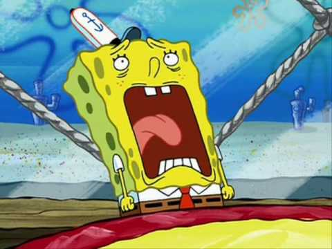
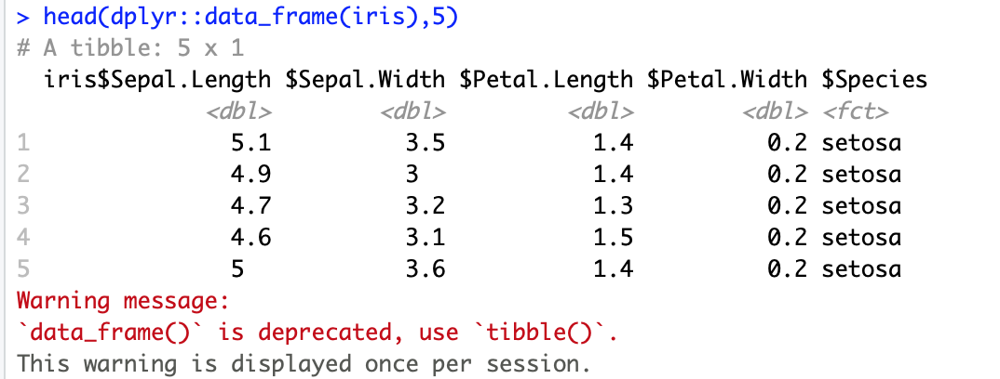
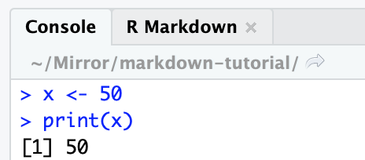
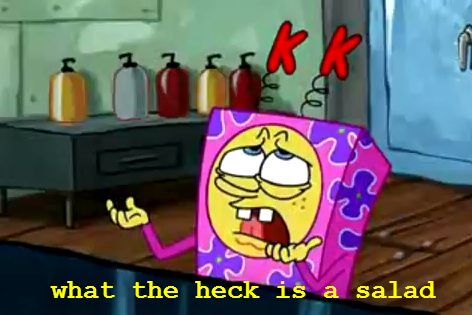

```{r setup, echo = FALSE}
## R setup ##

chooseCRANmirror(graphics = FALSE, ind = 1)
knitr::opts_chunk$set(warning = FALSE, message = FALSE, echo = TRUE, eval = TRUE)

## Load packages ##

# Package list
pkg_list <- c("plyr","tidyverse", "data.table", "ggplot2", "kableExtra")

# Load packages
pacman::p_load(pkg_list, character.only = TRUE)
```

# What is R Markdown?

<!-- Custom CSS formatting to left-align text and remove image borders -->
<style type="text/css">
  .reveal p {
    text-align: left;
  }
  .reveal ul {
    display: block;
  }
  .reveal ol {
    display: block;
  }
  .reveal section img { 
    background:none; 
    border:none; 
    box-shadow:none; 
  }
</style>

- [Markdown](https://en.wikipedia.org/wiki/Markdown) is a specific [markup language](https://en.wikipedia.org/wiki/Markup_language) with plain text-formatting syntax
- [R Markdown](https://cran.r-project.org/web/packages/stationery/vignettes/Rmarkdown.pdf) is a type of markdown language
- R Markdown combines R code (or code from other programming languages) and markdown in the RStudio integrated development environment (IDE)

## What will we talk about today?

1. Components of an R Markdown document
1. Output options
1. Content
1. Formatting
1. Trouble-shooting

<center></center>

## General tips

- Treat your data as read-only
- Comment code early and often
- Keep code chunks small
- Label chunks to help with diagnosing issues
- Nest all files under one directory (if possible)

# Parts of an R Markdown document

1. YAML header
1. Markdown
1. Code chunks

## YAML header

- The first part of your document is called the YAML header
- This is where you set global options for the output type and formatting
- This header is set apart from the rest of the document by three dashes

```
---
title: "Why R Markdown Is the Best"
author: "Me"
output: html_document
---
```

## Markdown

Plain text-formatting allows for conversion to different document types

```
1. People
1. Order
1. Our
1. Patties
```

1. People
1. Order
1. Our
1. Patties

## Code chunks

- Code chunks are set apart from markdown by three backticks at the beginning and end
- In curly brackets after the first set of backticks, you specify the coding language you want to use
- You can also add other arguments in the curly brackets

````
`r ''````{r example}
## Load packages ##

# Package list
pkg_list <- c(tidyverse", "ggplot2", "kableExtra", "patchwork")

# Load packages
pacman::p_load(pkg_list, character.only = TRUE)
```
````

## Code chunks (continued)

To test your code chunks, you can:

- Highlight the relevant lines of code and hit CTRL/command + enter
- Hit the green play button in the upper right-hand corner of the chunk
- Use the **Run** dropdown menu at the top right of the document

# Creating output

- Options for creating output
  - Specify output type with YAML header and `knit`
  - `render`
- Processing flow: [Rmd > knitr > md > pandoc > output](https://ulyngs.github.io/rmarkdown-workshop-2019/slides/Day2.html#35)

## Output types

- HTML: most flexible
- PDF: requires $\LaTeX$ to compile ([TinyTeX](https://yihui.org/tinytex/) distribution)
- Microsoft Office (Word/Powerpoint): most convenient for collaboration

## YAML specification

- Use the **output** argument in the YAML header
- Pay attention to indentation and colons
- Press the `knit` button or command/CTRL + shift + K

## Render

- Render files in the console with `rmarkdown::render(file, output_format)` 
- Create PDF from HTML with `pagedown::chrome_print(file)`

# Using output templates

1. Built-in templates
1. Templates from R packages
1. User-defined templates

## Built-in templates

- Documents
  - `html_document`
  - `pdf_document`
  - `word_document`
- [Presentations](https://rmarkdown.rstudio.com/lesson-11.html)
  - `ioslides_presentation` and `slidy_presentation` for HTML
  - `beamer_presentation` for PDF
  - `powerpoint_presentation`
- Interactive [Shiny](https://bookdown.org/yihui/rmarkdown/shiny-documents.html) documents and presentations

## R package templates

<!-- Packages from GitHub vs. CRAN -->
- Presentations: [`revealjs`](https://cran.r-project.org/web/packages/revealjs/index.html)
- CVs: [`vitae`](https://github.com/mitchelloharawild/vitae)
- Academic posters: [`posterdown`](https://github.com/brentthorne/posterdown)
- APA-formatted articles: [`papaja`](https://github.com/crsh/papaja)
- Journal templates: [`rticles`](https://bookdown.org/yihui/rmarkdown/rticles-templates.html)
- HTML theme: [`prettydoc`](https://github.com/yixuan/prettydoc)
- Manuscripts: [single document](https://bookdown.org/yihui/rmarkdown/bookdown-output.html#a-single-document) output from [`bookdown`](https://bookdown.org/yihui/bookdown/)

## $\LaTeX$ templates

```
---
output:
  pdf_document:
    template: plos_latex_template.tex
---
```

## Word document templates

Go to the Styles Pane in Word, format, and "Update to Match Selection"

```
---
output:
  word_document:
    reference_docx: template.docx
---
```

# Content

- R Markdown documents include the markdown text itself, as well as output from code chunks
- Code chunks can output data, graphs, tables, and images 
- You can also reference variables from code chunks in markdown text

## Markdown

- Look at [R Markdown: The Definitive Guide](https://bookdown.org/yihui/rmarkdown/markdown-syntax.html) for a comprehensive list of type-setting features
- Line spacing matters
- Escape special characters with a backslash

## Inline R

```{r iris_example_1, message=FALSE, warning=FALSE}
# Pull species column from iris and get unique values in column
species <- iris %>% pull(Species) %>% unique()

# Get number of unique species
species_count <- length(species)
```

- I can report that there are `r species_count` species without writing out the number itself with `` `r knitr::inline_expr('species_count')` ``
- I can also reference report the exact species names with`` `r knitr::inline_expr('species')` ``: `r species`

# Formatting

1. YAML parameters and references
1. Inline $\LaTeX$ and CSS code
1. Custom edits to templates
1. Custom functions

## YAML parameters

[General YAML parameters](https://ymlthis.r-lib.org/articles/yaml-fieldguide.html)

```
---
title: |
  <center> A very impressive title: </center>
  <center> An equally impressive subtitle </center>
---
```

## YAML references

- Bibliography: [.bib](https://rmarkdown.rstudio.com/authoring_bibliographies_and_citations.html) (I use BibDesk for my reference manager)
- Citation style language: [.csl](https://github.com/citation-style-language/styles)
- $\LaTeX$ styling: .cls
- HTML styling: .css
- Interacting with pandoc: .lua ([multiple bibliographies](https://github.com/pandoc/lua-filters/tree/master/multiple-bibliographies))

## Inline $\LaTeX$&nbsp; and CSS code

- $\LaTeX$ with PDFs
  - Calling $\LaTeX$ packages
  - Using [symbols](https://www.rpi.edu/dept/arc/training/latex/LaTeX_symbols.pdf)
  - Using type-setting commands (e.g., \\vspace{12pt})
- [CSS](https://developer.mozilla.org/en-US/docs/Web/CSS) with HTML

## Editing templates

1. Find out where your R packages "live" by calling `installed.packages()`
1. If the template generates a style document (e.g., .cls) in the directory with your .Rmd file, you can edit that without going to the package

## Custom functions

- You can write R formatting functions for yourself to make your life easier when you're referencing variables in your text (e.g., *p* values)
- You can find all of my convenience functions in the [source script](https://github.com/hollzzar/manuscript-template/blob/main/sections/code/scripts/source_script.R) in my [reproducible scientific manuscripts template](https://github.com/hollzzar/manuscript-template)

# Trouble-shooting

<center></center>

## Identifying issues


1. Warnings vs. errors
1. RStudio vs. R Markdown environments
1. Package issues
1. Strategies for troubleshooting issues

## Warning



## Chunk error 


## Markdown/YAML error 


## Environments



## R code and environments

```{r environment, eval=FALSE}
# Define new variable y
y <- 100

# When I run this chunk, I get the expected output (150),
# but it fails when I try to knit the document
# I've set eval=FALSE for this chunk, so it doesn't try to run and prevent my document from knitting
print(x + y)
```

<center></center>

## Package specification

- Different packages can have the same name for different functions, creating a *name-space conflict*
- Tell R which package to look in with `package::function` notation

## Updates

- [Update your TeX distribution](https://tex.stackexchange.com/questions/55437/how-do-i-update-my-tex-distribution) from the command line
- Update all packages (including `rmarkdown`) in your library with `update.packages(path)` 
- Update individual packages with `install.packages("package")`
- Update R in the console with the `updateR` package
- Re-download RStudio to update

## Reset your R environment

- Clear all variables by running `rm(ls = list())` in the console
- Restart your R environment with CTRL/(control + fn) + shift + F10
- Run all chunks individually **in order** before compiling to test code


## Search for information

- Use the Help window in RStudio
- Search for the package in the console with `?package` or `??package`
- Google the error you're getting with the package or function you're trying to use

# Takeaways

1. YAML header: define output types, templates, and additional parameters
1. Setup chunk: define global chunk options
1. Markdown: add information/descriptions and control local text behavior with $\LaTeX$/CSS (depending on output)
1. Chunks: add R code and control local chunk behavior

## Reference documents

- Official [R Markdown Guide](https://bookdown.org/yihui/rmarkdown/)
- My [R Markdown Guide](https://www.hzaharchuk.com/rmarkdown-guide/)
- [R Markdown Cheat Sheet](https://rstudio.com/wp-content/uploads/2016/03/rmarkdown-cheatsheet-2.0.pdf)
- [R Markdown Reference Guide](https://rstudio.com/wp-content/uploads/2015/03/rmarkdown-reference.pdf)
- [Keyboard shortcuts](https://support.rstudio.com/hc/en-us/articles/200711853-Keyboard-Shortcuts)
- [`knitr` documentation](https://yihui.org/knitr/)

## Other packages/tools

- [Sublime Text](https://www.sublimetext.com/3) text editor
- [`scholar` package](https://github.com/jkeirstead/scholar) for automatically downloading citations from Google Scholar
- `devtools` package for installing packages/plug-ins from GitHub (e.g., `papaja`)
- [wordcountaddin plug-in](https://github.com/benmarwick/wordcountaddin) for checking word count and readability

## Questions?

<center></center>